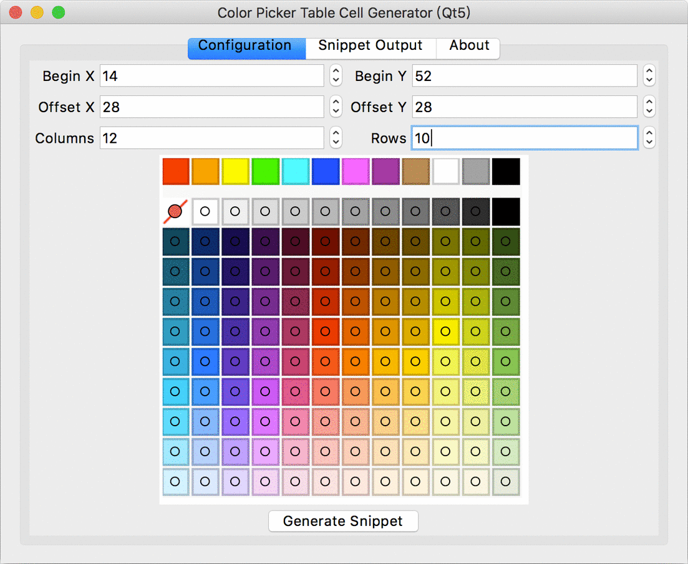

# GenColorPickerTableCells.py

Generate color picker table cells for Qt5's table widget.



## Running
> Note: Python version >=3.7.0 is required.

With Python 3

```shell
python GenColorPickerTableCells.py
```

## License

This project is licensed under the GNU General Public License v2.0 - see the [LICENSE.txt](LICENSE.txt) file for details.
